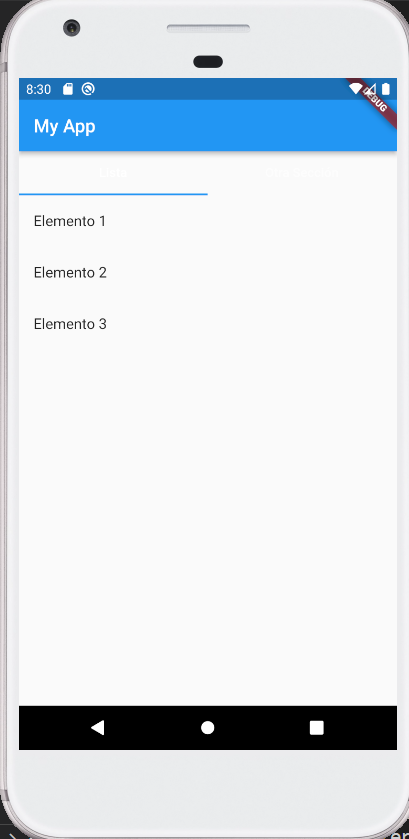
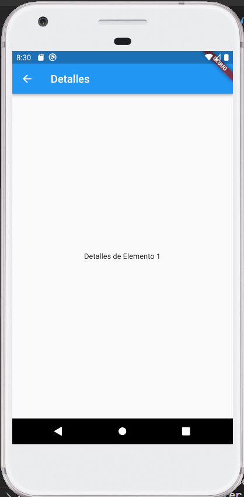

# Desafío de Codificación en Flutter: Implementación de Widgets y ListViews

## Descripción

Esta aplicación Flutter es un ejemplo básico que demuestra la implementación de una interfaz de usuario con navegación entre diferentes secciones, utilizando listas y detalles de elementos. La aplicación incluye una pantalla principal con un `AppBar` y un cuerpo dividido en pestañas para mostrar contenido diverso.

## Estructura del Proyecto

- **lib/main.dart**: Punto de entrada de la aplicación.
- **lib/home_page.dart**: Define la pantalla principal de la aplicación.
- **lib/tab_bar_view.dart**: Contiene la implementación de la vista con pestañas.
- **lib/list_view.dart**: Implementa una lista de elementos y la navegación a la pantalla de detalles.
- **lib/details_screen.dart**: Muestra detalles adicionales sobre un elemento seleccionado.

## Cómo Navegar

1. Al abrir la aplicación, verás una pantalla principal con un `AppBar`.
2. En la pestaña, se mostrará una lista de elementos.
3. Toca cualquier elemento en la lista para ver más detalles en una pantalla separada.

## Capturas de Pantalla

 

## Dependencias

Asegúrate de tener todas las dependencias necesarias instaladas. Puedes encontrar la lista de dependencias en el archivo `pubspec.yaml`.

## Ejecución del Proyecto

Para ejecutar este proyecto, sigue estos pasos:

1. Asegúrate de tener Flutter y Dart instalados en tu sistema.
2. Clona este repositorio.
3. Navega a la carpeta del proyecto en tu terminal.
4. Ejecuta `flutter pub get` para obtener las dependencias.
5. Ejecuta `flutter run` para iniciar la aplicación.